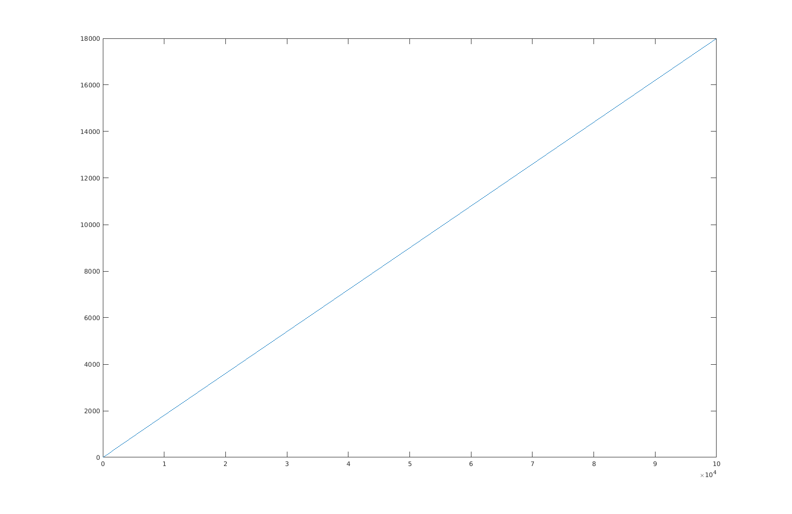
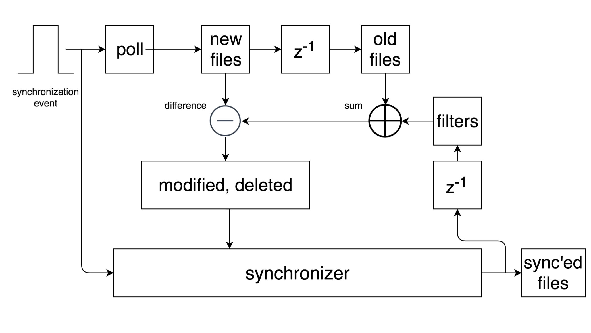

# ExTRA Final Report
|table of contents|
|-----------------|
|System Design    |
|Core Version Tracking|
|File System Monitoring|
|Chunked File Transfer|
|Implementation Specific Details|

# System Design

Extra has three main components: a file system monitor that polls a
directory, a core version tracking algorithm that uses both version
vectors and synchronization vectors, and finally a chunked file transfer
protocol which only transmits different chunks. Upon receiving a sync
event, Extra prepares a change list of every file it tracks. It either
sends the change list to the receiver or it compares its change list with
the sender's in order to determine which files to synchronize.

# Core Version Tracking

Version Vectors
----------------

Extra uses version vectors to keep track of the modification history of
a file. Extra represents each file with a monotonically increasing
counter so that when the file system monitor detects a change in a file,
Extra appends an *<ID, counter>* pair to the file's version vector and
then increments the count.

Here is an example of 3 computers A, B, and C sending a single file to
eachother. Modifications are represented as shape changes.

<!-- language: lang-none -->

      1   2       3   4
     +------------------
    A|■     ▲
     | \   / \
    B|  ■ ▲   \     ◆ ●
     |         \   /
    C|          ▲ ◆

At each spot 1, 2, 3, and 4 the file has been modified.
In spot 1 the version vector is <A1>. In spot
2 the version vector is <A1, B2>. In spot
3 the version vector is <A1, B2, C3>.
In spot 4 the version vector is <A1, B4, C3>

Synchronization Vectors
-----------------------

Unlike version vectors, synchronization vectors track the
synchronization history of the file. Qualitatively, they track how aware
computers are of each other's state. This extra knowledge, in addition
to the version vectors, enables the synchronizer to avoid false
conflicts, which we will see soon. Extra implements these vectors
using the same monotonically increasing counter as the version vectors.
After a successful synchronization, each participant in the sync,
updates its synchronization vector with the IDs of the participants and
the current value of the file's counter. The counter does not increment
after synchronizations, only modifications. For the same example above,
the synchronization vector at spot 1 is <>. In spot 2 it is
<A1, B1>. In spot 3 it is <A2,
B2, C2>. In spot 4 it is <A2,
B3, C3>.

Determining The Most Recent File During a Sync
-----------------------------------------------

Both version vectors and synchronization vectors form a partially
ordered set of (ID, count) pairs, so the operators less than and equality can be defined for this set.
For two sets of version vectors or synchronization vectors:

<!-- language: lang-none -->

    A == B iff (all elements of A are in B) AND (all elements of B are in A)

    A < B  iff (
        (all elements of A are in B)
        AND
        (the count of every element in A is less than the corresponding count in B)
      )
    AND
    (B has at least one element whose counter is greater then the counter of the corresponding element in A)

    A <= B iff (A < B) || (A == B)

Now pretend A and B are version vectors of a file. If A <= B, then
version A is a superset of version B. Simply put, A is a newer file. If
A !<= B and B !<= A, then that means that the two files have diverging
histories and are now in a conflict.
The basic algorithm for file synchronization using version vectors only is
thus:

<!-- language: lang-none -->

    sync(A -> B, file):
      if (A.modification == B.modification)
        //do nothing
      else if (A.modification < B.modification)
        //do nothing
      else if (B.modification < A.modification)
        //accept the new file
      else
        //report a conflict

Going back to the file in the example above:
<!-- language: lang-none -->

      1   2       3   4
     +------------------
    A|■     ▲
     | \   / \
    B|  ■ ▲   \     ◆ ●
     |         \   /
    C|          ▲ ◆

The sync that occurs with B and C right at spot 3
will compare the following version vectors:

B : <A1, B2>

C : <A1, B2, C3>

According to the rules above, B's version vector is less than C's version vector so
B should accept C's file.

The First False Conflict
-------------------------------

Version vectors worked so great for the simple example above because it
had no conflicts. In the diagram below, A and B have conflicting
versions of the same file because both versions appear to have been
created at the same time. This can very easily happen if either A or B
were disconnected from the internet and modifications were made on both
computers.

<!-- language: lang-none -->

      1   2 3     4   5
     +------------------
    A|■   ● ?
     | \   /
    B|  ■ ▲

During the sync attempt at spot 3, A has version vector <A2>
and B has version vector <A1, B2>. According to
the version vector algorithm, this file now has a conflict. There are
3 ways to resolve the conflict: A can keep its own version, take B's
version, or merge the conflicting files into a new file. If A takes B's
version, then everything is all good and A's circle will change into a
triangle. If A merges its own file with B's, that is also OK and A's
circle will change into a totally new shape that represents the merged
files. The troubles begin if A decides to keep its current version.
If A keeps its
current version, then it leaves its version vector unmodified. This
means that future sync attempts with B will keep reporting the same
conflict over and over again. Reporting the same conflict over again,
despite the user's wishes, is a false conflict.

How Synchronization Vectors Can Help
---------------------------------------------

Even though version vectors contain enough information to determine
which file is newer, they do not contain enough information to indicate
how up-to-date computers are with each other. The false conflict in the
example above can be easily avoided if A and B could agree that they are
up to date with respect to each other after the first sync, no matter
the conflict resolution. This is what
synchronization vectors do in Extra - basically a 👍 after the sync.
Future syncs between A and B wont do anything unless the actual versions
of the files have changed since the previous sync. A modified
synchronization algorithm, which takes synchronization time into account
is shown below.

<!-- language: lang-none -->

    sync(A -> B, file):
      if (A.modification <= B.synchronization)
        //do nothing
      else if (B.modification <= A.synchronization)
        //accept the new file
      else
        //report a conflict, files have independent histories

Lets replay the false conflict above but this time with synchronization
vectors too:
<!-- language: lang-none -->

      1   2 3     4   5
     +------------------
    A|■   ● ?
     | \   /
    B|  ■ ▲

During the sync at spot 3, A has version vector <A2> and
synchronization vector <A1, B1>. B has version
vector <A1, B2> and synchronization vector <A1, B1>.
According to the new algorithm, there is a conflict when B syncs to A! A
has 3 options (just like before):

**if A takes B's version**:
<!-- language: lang-none -->

      1   2 3     4   5
     +------------------
    A|■   ● ▲
     | \   /
    B|  ■ ▲

After the sync A's version vector is <A1, B2> and
A's synchronization vector is <A2, B2>. B's
version vector and synchronization vector are exactly the same.

**if A merges B's version**:
<!-- language: lang-none -->

      1   2 3     4 5
     +------------------
    A|■   ● ◆     ◆
     | \   /       \
    B|  ■ ▲         ◆

Conceptually, the merge is equivalent to taking B's version and then
modifiying it. So, after the sync, A's version vector is <A3,
B2> and synchronization vector is <A2, B2>.
B's version vector is <A1, B2> and synchronization
vector is <A2, B2>. Notice that a future sync of
A->B would also replace B's version with the merged version. This is
expected behavior.

**if A rejects B's version**:
<!-- language: lang-none -->

      1   2 3     4 5
     +------------------
    A|■   ● ●       ●
     | \   /       /
    B|  ■ ▲       ▲

If A rejects B's version, then we would like for future synchronization
attempts involving the same file versions to remember the result.
Synchronization vectors give us this property. After the sync, A has
version vector <A2> and synchronization vector <A2, B2>.
B has version vector <A1, B2> and synchronization
vector <A2, B2>. Notice how, according to the new
synchronization algorithm, the future sync attempt at spot 4 does not
report the same conflict again.

Handling File Deletions
-------------------------
File deletions can mostly be treated like modifications except for when
deleted files conflict or when an independent file with with the same
name is re-created. Conflicting file deletions is shown below. An empty
shape means that the file has been deleted.

**Conflict of Two Deleted Files**:
<!-- language: lang-none -->

      1  2  3     4 5
     +------------------
    A|▲  △ ?
     |    /
    B|■  □

What we would like to happen, in this case, is *nothing* because one file
deletion is just as good as any other. If file deletions are just
represented as modifications though, then synchronizing two deleted files will
report a false conflict. This false conflict can be fixed by adding a
deletion notice to a file when it is deleted. When two deleted files are
being synchronized, no conflict is reported and only their
synchronization times are updated.

**Create After Delete**:
<!-- language: lang-none -->

      1 2 3 4 5
     +------------------
    A|▲ △ ?
     |   /
    B|  ■

In this example, B syncs a file with the same name as A's deleted file,
but B's file is created *after* A's deleted file. Once again, treating
deletions as just a modification will result in a false conflict because
A should accept B's independently created file. This false conflict can
be fixed by also keeping track of a file's creation time in addition to
its modification time, synchronization time, and deletion status. The
creation time is the first version pair of a file. When synchronizing
deleted files, the creation time is used to determine if the files are
independent. A's creation time is A1 and B's creation time
is B 1 and since that is not less than or equal to A's
creation time, B's file must be independent.

In order to take these rules for file deletions into account, Extra uses
a special synchronization algorithm when the destination peer does not
have the file:

**Special Sync Algorithm For Deleted Files**
<!-- language: lang-none -->

    //called only when file does not exist on B
    sync(A -> B, file):
      if (A.modification <= B.synchronization)
        //do nothing
      else if (A.creation !<= B.synchronization)
        //accept the new file, it was created independently
      else
        //report a conflict, files have diverged

What About Directory Entries?
-------------------------------
Extra does not version track directory entries themselves, so it will
never sync an empty subtree. Some other file synchronizers, including
Tra, do version track directory entries though. Just like files,
directory entries can have version vectors and synchronization vectors.
The synchronization time of a directory is the element-wise minimum of
the synchronization vectors of all its children. The version vector of a
directory is the element-wise maximum of the version vectors of all its
children. When a directory's synchronization time on one computer is
greater than its modification time on another, then synchronization of
the whole subtree can be skipped.

Extra does not track directory entries for two reasons. The first reason is
that Extra uses change lists to speed up a sync. Change lists avoid the
TCP ping pong that occurs when Tra walks the directory tree over the
network. The second reason is because empty directories seem like a
useless thing to synchronize between computers. In Extra, every
non-empty directory will get implicitly sync'ed along with its files.

Optimizations to Reduce Metadata Storage Cost and Synchroniation Time
------------------------------------------------------------------------
The ideas and algorithms from above represent the core of Extra (and
Tra), but storing the entire version vector of a file is actually
unecessary and wastes space. Recall that in the synchronization algorithm that uses
both version vectors and synchronization vectors, the version vector
only appears on the left-hand-side of the <= operator. Now observe that
the synchronization vector is assigned to a superset of the version
vector at the end of a sync. So *the only element in the version vector
that actually matters in the comparison is the last element*.
Intuitively, Extra only cares about the *new* information since the last
time a sync happened because the agreement of the *old* information is
stored in the synchronization vector. For non-deleted files, Extra must
only store a scalar for the version vector, not a full list.

Deleted files require even less information. From inspecting the
deletion algorithm in the same way as the regular synchronization
algorithm, we can see that Extra only needs to store the creation time,
deletion notice, and synchronization vector of deleted files.

During synchronization, Extra constructs a changelist to determine
which files to transfer. Unlike Tra, which walks the file tree and
determines which directories to sync, Extra packages all of its version
vectors and synchronization vectors and sends them to the receiver in a
single network transfer. Then the receiver responds with which files it
wants.

With these cost optimizations, Extra's state size is able to scale linearly with the
number of files that are being synchronized. I took some measurements,
just to be sure though. All of the files in the table below are *newly
created* and then synced once. This means that their version vectors are
unit size and so are the synchronization vectors. Since Extra does not
care about the file contents, that data does not factor into the storage
size (unlike git).

|# Files| Stored size|
|-------|------------|
|10     |4kb         |
|20     |4kb         |
|40     |8kb         |
|80     |16kb        |
|100    |20kb        |
|400    |72kb        |
|800    |144kb       |
|2000   |356kb       |
|5000   |896kb       |
|10000  |1.8MB       |
|100000 |18MB        |

It looks very linear, the plot confirms it.

# File System Monitoring

Discovering Changes
-------------------------
ExTRA monitors the synchronized folder tree by polling.
To poll a directory, extra recursively walks the path and constructs a
set that contains every file and its wall clock modification time. Then
this set of current files is compared to a set of previous files from
the last poll to determine which files have been modified and deleted.
The file system monitor does not explicitly track created files because
that information is deduced from the deletion notices on the file
synchronization vectors.

Extra only polls the filesystem right before a synchronization event.
It is unecessary for Extra to know about the intermediate changes to a
file in between synchronization events because Extra does not backup
file contents. Extra is a synchronizer, not a backup utility.

Avoiding False Change Detections
------------------------------------

Extra should only detect when a *user* modifies a file, not the files
that are modified as a result of the synchronization. Extra accomplishes
this by cancelling out the false detections during the set difference of
the old and new files. A block diagram of the operation is shown right
above. The operation of Extra can be interpreted as a sequential logic
circuit with synchronization events serving as the clock. Every time a
new synchronization event is received the new file list becomes the old
file list and the synchronizer stores the changes it makes to the
filesystem in the 'filters' variable. Then, on the next synchronization
cycle, the filters are added to the set of old files because they are
expected to also appear in the set of new files. As a result of the
filters, changes to the directory tree that are made by Extra will not
be detected.

Persistence
-------------------------
When Extra exits and restarts (or crashes), it can recall its previous
state and keep going. At the end of every synchronization event, Extra
writes the version vectors, synchronization vectors, filters, and new files from
the directory monitor into a compressed persistence file. This is all of the
state that Extra uses to function. It is possible that the user will
modify the directory tree while Extra is offline, but this is no
problem. On startup, Extra polls the directory tree but it does not
sync. This way, modifications made by the user while the file
synchronizer was offline are picked up.

# Chunked File Transfer

Rolling Hash
-----------------------
<!-- -->

<!-- -->

When Extra is synchronizing a huge file, only the parts of it that have
changed should be transferred over the wire. In order to do this, Extra
uses an adler32 rolling hash algorithm just like Rsync. In this algorithm, the
current value of the rolling hash is used to produce a cut point in the
file everytime the hash becomes a multiple of 65521. Since the hash
function is just a moving sum, re-calculating its value for the current
byte is very fast: subtract the oldest byte from the sum and add the
newest byte. During a file
transfer, the sender sends its file chunks to the receiver and the
receiver compares them to its own chunks.

Chunk Comparison
----------------------

<!-- language: lang-none -->
    File A
    +-------------------------
    |    |     |   |     |  |
    |    |     |   |     |  |
    +-------------------------
    0                        n

    File B
    +-------------------------
    |    |     |   |     |  |
    |    |     |   |     |  |
    +-------------------------
    0                        n

Shown above is the cutlist of two identical files. Vertical bars
represent a cut. Since the files are identical, the rolling hash mod
65521 will equal zero at all the same spots. Lets see what happens if
file A acquires an insertion somewhere in the middle:

<!-- language: lang-none -->
    File A
    +-------------------------
    |    |       |    |  |  |
    |    |       |    |  |  |
    +-------------------------

    File B
    +-------------------------
    |    |     |   |     |  |
    |    |     |   |     |  |
    +-------------------------

The cut lists lose alignment near the location of the insertion but then
they become aligned again away from the insertion. The length of misalignment in the cut lists
is due to the window size of the rolling hash. The rolling hash of the
two files will only differ during the time in which the insertion is
moving through the window. Eventually it will leave, and the rolling
hashes of the files will match again and produce equal cutpoints.

In order to uniquely identify each chunk, though, Extra needs one more
piece of information. Extra uses a very small window size for the
adler32 rolling hash function so it is very likely that the rolling
hashes of two unrelated chunks will equal each other. Hence, it is only
OK to use the rolling hash to determine chunk inequality. Extra extends
the information in a chunk with the SHA256 hash of all the bytes that
comprise the chunk. With the stronger SHA256 hash, false positives can
be detected much more reliably.

Chunk Assembly
---------------------
<!-- language: lang-none -->
    type FileChunk struct {
    	Offset   int64
    	Checksum uint64
    	Size     int64
    	Sha      [32]byte
    }

During a file transfer, the receiver compares its chunks with those of
the sender to determine which ones it needs. The chunk struct definition
is shown above. A list of []FileChunk contains all of the information
necessary to find incremental differences in a file. Extra does this one
way with the pseudocode below

<!-- language: lang-none -->
    func Diff(them, ours []FileChunk) ([]FileChunk, ([]FileChunk, Offset)) :
    //first put our chunks into a map to speed up search
    table=new map
    for chunk in ours:
     table[ours.checksum] += chunk

    //next loop over their chunks
    for chunk in them:
      if exists(table[chunk.checksum]) && chunk.Sha == table[chunk.checksum].Sha :
        //record that we have the chunk and also its new offset (if different)
        have+=(table[chunk.checksum], chunk.Offset)
      else:
        need+=chunk

After running this search algorithm, the receiver has a list of chunks
that it can request and a different list of chunks that it needs to move
around.

# Implementation Specific Details
This section aims to describe the coding patterns that are present in
Extra. It is probably only useful for contributing.

Pairwaise Synchronizing
--------------------------

There are only two synchronization functions in Extra:
<!-- language: lang-none -->
    //sync an entire path to a remote
    func syncto(host string, username string, dirtree *Watcher, state map[string]File, filters, deleted_filters []Sfile, persist persistfunc) map[string]File
    func syncfrom(from net.Conn, dirtree *Watcher, state map[string]File, filters, deleted_filters []Sfile, persist persistfunc) (map[string]File, []Sfile, []Sfile)

Syncto takes the hostname to sync to , the username of that host, the
current state, and a directory tree monitor. It attempts to contact the
remote host and complete the synchronization. On the receiving end, syncfrom is called with a handle to sender and
also the current state of the receiver. In order to register sync
events, Extra listens on a port and puts events into the event loop
whenever a host is trying to connect and sync.
